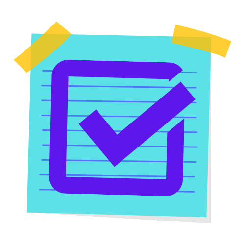
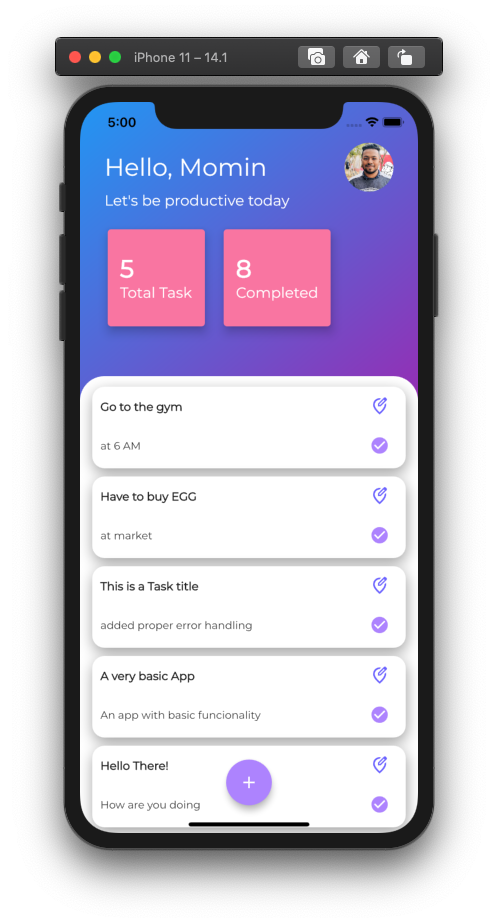
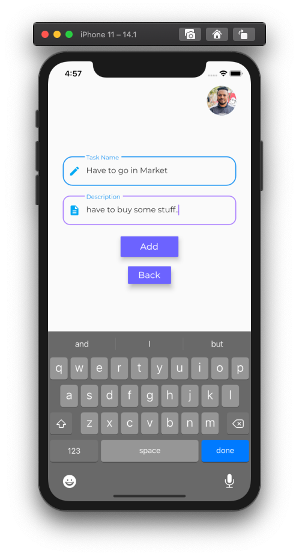
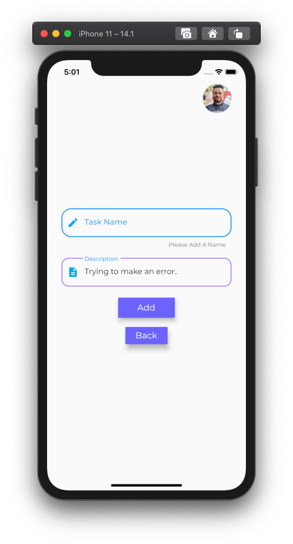

# kajtodo

This is a very basic To Do application. You can add a task, update a task, delete a task. This saves the task data on your phone.

- Swipe to delete a Task

 This is a practice app. Just playing with flutter. You can use it if you want. 

 The design of this app was inspired <a href="https://dribbble.com/shots/13998970-Simple-Task-App">from here</a>. I will try to implement the full UI of this design in future. Inshallah.
