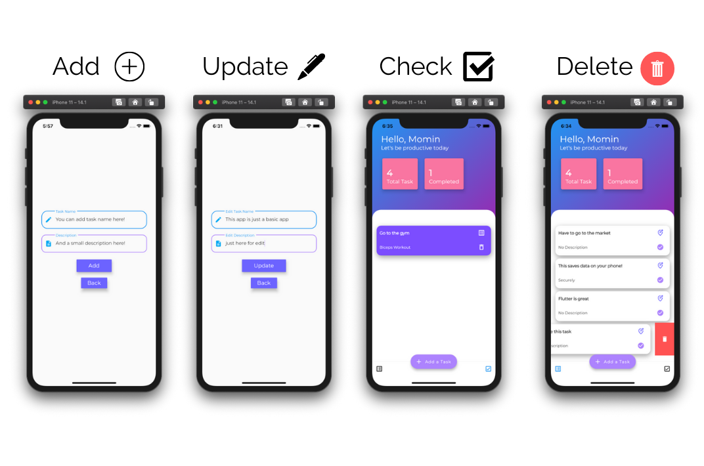

This is a very basic To Do application. You can add a task, update a task, delete a task. This saves the task data on your phone.

## How to use
- Swipe to delete a Task
- Long Press to edit a Task

## Packages I used on this app
- Provider - Great for state management. (Recommended by Flutter)
- Hive - Used for database.

 This is a practice app. Just playing with flutter.

 The design of this app was inspired <a href="https://dribbble.com/shots/13998970-Simple-Task-App">from here</a>. I will try to implement the full UI of this design in future.

